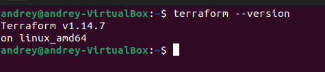
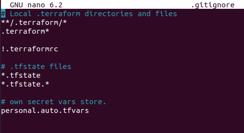
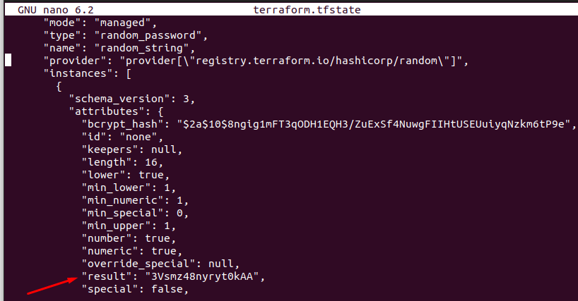
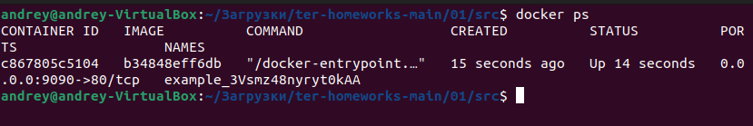
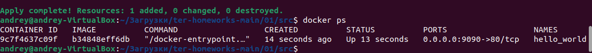
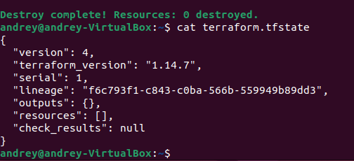
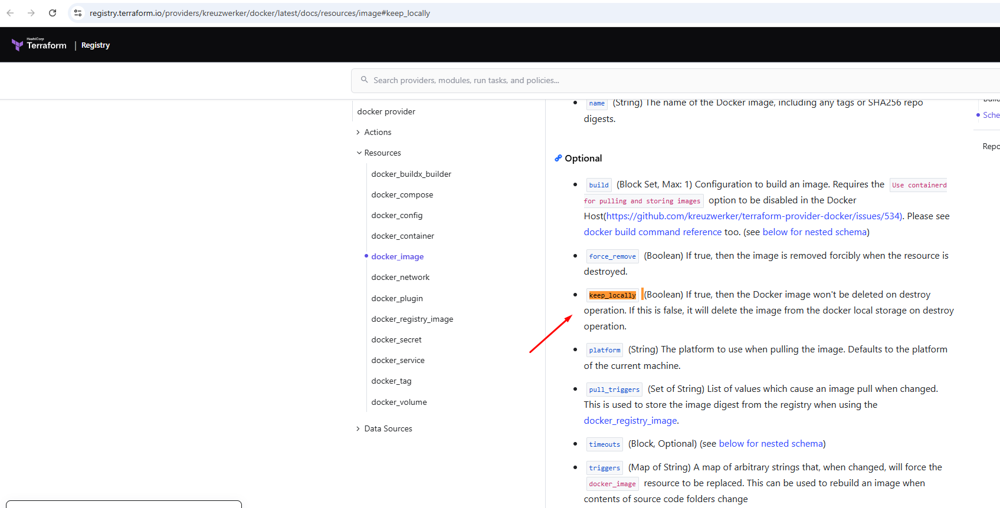
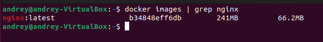

## Установка Terraform и Docker

**Версия Terraform:**

## Файл для хранения секретов (из .gitignore)
 в файле .gitignore присутствует строка:

own secret vars store.

personal.auto.tfvars

Из этого следует, что личная, секретная информацая (логины, пароли, ключи, токены)  хранится в файле personal.auto.tfvars. 

## Секретное содержимое ресурса random_password в state-файле
После выполнения первого terraform apply (с закомментированным блоком Docker) в файле terraform.tfstate был создан ресурс random_password.random_string. В state-файле найден атрибут:

Ключ: result

Значение (сгенерированный пароль): 3Vsmz48nyryt0kAA

## Исправление ошибок в раскомментированном блоке (строки 29–42)

При раскомментировании блока с Docker и выполнении terraform validate были обнаружены намеренные ошибки. 
Ниже приведены все ошибки и их исправления.

1	У ресурса docker_image отсутствует локальное имя	Добавлено "nginx": resource "docker_image" "nginx" {

2	Имя ресурса docker_container начинается с цифры ("1nginx")	Переименовано в "nginx": resource "docker_container" "nginx" {

3 Указан несуществующий ресурс random_string_FAKE	Исправлено на: name = "example_${random_password.random_string.result}"

4	Блок ports находился вне ресурса docker_container	Перенесён внутрь ресурса (перед закрывающей })

## Выполните код. В качестве ответа приложите: исправленный фрагмент кода и вывод команды docker ps

## Замена имени контейнера на hello_world и опасность -auto-approve
В ресурсе docker_container изменено поле name на "hello_world" (имя образа осталось "nginx:latest"). После этого выполнен apply:

bash
terraform apply -auto-approve
Опасность ключа -auto-approve:

Terraform применяет изменения автоматически, без запроса подтверждения (yes).

В производственной среде это может привести к непреднамеренному удалению или изменению критических ресурсов, недоступности сервисов или потере данных.

В то же время ключ полезен для CI/CD и автоматических развертываний, а также для локальной разработки, когда вы уверены в изменениях и не хотите тратить время на подтверждение.

## Уничтожение ресурсов и содержимое terraform.tfstate

## Почему образ nginx:latest не был удалён
В ресурсе docker_image явно указан параметр:

keep_locally = true

Согласно документации провайдера Docker:
**https://registry.terraform.io/providers/kreuzwerker/docker/latest/docs/resources/image#keep_locally**

keep_locally – If true, then the Docker image won't be deleted on destroy operation.

Именно поэтому после terraform destroy образ nginx:latest остался в локальном хранилище Docker. 

